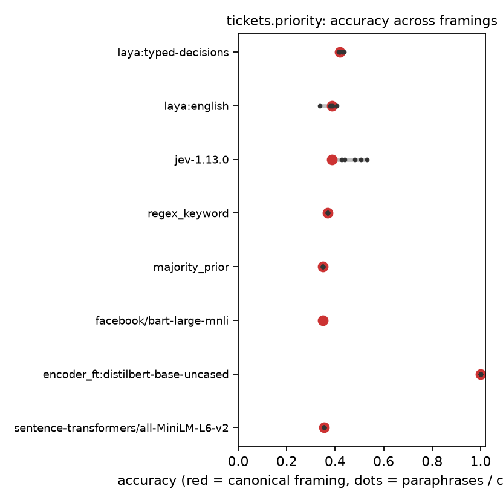
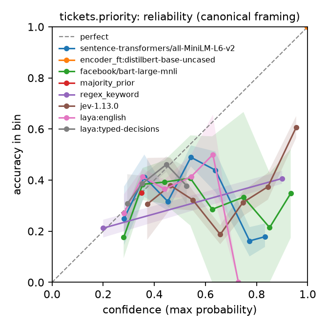

<p align="center">
  
</p>

<p align="center">
  <a href="https://pypi.org/project/sys1bench/"></a>
  <a href="https://pypi.org/project/sys1bench/"></a>
  <a href="https://github.com/rssr25/system-one-bench/actions/workflows/ci.yml"></a>
  <a href="LICENSE"></a>
  
  
  <a href="docs/RESULTS_2026-09-22_narrative.md"></a>
</p>

**sys1bench** benchmarks *System One decision models*: non-autoregressive models that read a block of state plus typed questions (`choice`, `score`, `noul`) and return a calibrated probability distribution in one forward pass, instead of generating text. The first two such models are TypeSafe's hosted **Jev** and Convai's open-weight **Laya**; the harness is model-agnostic so the next ones plug in through an adapter or a YAML file.

It answers the questions a vendor scorecard does not: whether the model beats trivial baselines on the same items, whether its accuracy depends on how the question is worded, whether its probabilities mean anything and in which direction they are wrong, whether confidence can gate actions, how it degrades with option count, state length, noise and out-of-scope inputs, whether batching questions changes answers or only cost, and what all of it costs per 100k decisions.

---

## Why another benchmark

| Existing practice | sys1bench |
|---|---|
| Public datasets the models may have trained on | Generated items whose label follows a **stated policy** the model must apply, plus paired control arms (unknowable, label-noise, distractor, none-of-the-above) |
| One accuracy number per task | Accuracy as the **median over five paraphrases and three criteria variants**, with the range shown |
| Raw ECE at one binning | ECE **divided by its resampled noise floor**, smooth CE, Brier decomposition, clipped NLL, quantisation report, per-half temperature refit |
| Hosted and local latency on one axis | Separate sections; device recorded on every row; a local model that lands on CPU when CUDA was requested **aborts the run** |
| Seeds as the unit of variance | Item-level paired bootstrap, McNemar, cluster bootstrap over framing groups |
| Silent fixes | Renormalisation, truncation, abstention and vendor rejections are **recorded as rates**, never patched over |

## Install

```bash
pip install sys1bench                 # core: numpy, scipy, pandas, pydantic, httpx, typer
pip install "sys1bench[plots]"        # + matplotlib for reliability / risk-coverage / framing plots
pip install "sys1bench[laya]"         # + the laya package (needs torch; GPU recommended)
pip install "sys1bench[local]"        # + torch, transformers, sentence-transformers baselines
```

From source: `git clone https://github.com/rssr25/system-one-bench && cd system-one-bench && uv pip install -e ".[dev]"`.

## Quickstart (offline, two minutes)

```bash
sys1bench generate support_tickets tickets.jsonl --n 200 --seed 42
sys1bench run tickets.jsonl preds.jsonl --adapter mock --framings support_tickets --permutations 3 --corruption --short-circuit
sys1bench run tickets.jsonl prior.jsonl --adapter majority_prior
sys1bench score preds.jsonl prior.jsonl --out summary.json
```

```
| model             | acc (median) | acc range      | ECE/floor | ECE15 | Brier | AURC  | cov@5% | T     | perm JSD | p50 ms |
|-------------------|--------------|----------------|-----------|-------|-------|-------|--------|-------|----------|--------|
| mock-v1 / queue   | 0.783        | [0.783, 0.795] | 2.736     | 0.124 | 0.387 | 0.214 | 0.000  | 1.070 | 0.182    | 5.9    |
| mock-v1 / priority| 0.750        | [0.750, 0.752] | 3.614     | 0.096 | 0.438 | 0.195 | 0.004  | 1.271 | –        | 5.9    |
```

## Run it on a real model

```bash
# Jev (hosted, first-party API)
echo 'TypeSafe_API_KEY=...' > .env
sys1bench canary jev_typesafe --model jev-1.13.0                        # 200 fixed items; drift baseline
N=500 PERMS=3 CONC=4 scripts/run_suite_A.sh configs/models/jev_1.13.yaml results/jev
scripts/run_sweeps.sh configs/models/jev_1.13.yaml results/jev_sweeps results/jev/tickets.jsonl

# Laya (local)
scripts/run_suite_A.sh configs/models/laya_en.yaml results/laya_en
BUDGET=1 scripts/run_sweeps.sh configs/models/laya_en.yaml results/laya_en_sweeps results/jev/tickets.jsonl

# Report + plots for everything under results/
scripts/finalize_results.sh
```

`results/REPORT.md` contains, per model: the headline table above, ordinal fidelity for `score` questions, the framing table (paraphrases, label-only, with negatives, vague, swapped descriptions), decomposition, control arms and audits, then the sweep tables (cardinality, length, interference, robustness, prior shift, option budget), and cost. `results/plots/` overlays every model on the same reliability, risk-coverage and framing-range axes.

### Adding your model

| Your model | What to do |
|---|---|
| Hosted, conventional JSON decisions API | Copy [`configs/models/example_future_vendor.yaml`](configs/models/example_future_vendor.yaml), fill in URL, auth env var and field names. No code. |
| Anything else | Subclass `BaseAdapter`: declare `capabilities` (primitives, max options, state tokens, native abstain, batching) and implement `decide` (state + typed questions in, one probability vector per question out). Register with `@register("my_model")` or the `sys1bench.adapters` entry-point group from your own package. |

Capability limits are declared, then measured: a request outside them is recorded as a `capability_issue` or `rejected_by_vendor` row, never a crash.

## Suites

| Suite | Question it answers | Key outputs |
|---|---|---|
| **A** Calibration & selective prediction | Do the probabilities mean what they say? Can confidence gate actions? | ECE/floor, smooth CE, Brier, NLL, temperature refit, AURC, coverage@risk, abstention, unknowable arm |
| **B** Framing sensitivity | Is the accuracy a property of the model or of the wording? | median [min, max] over paraphrases, criteria variants, corruption drop, decomposition gain |
| **C** Scaling | How does it behave with 2 to 255 options, 128 to 32k tokens, and (Laya) option budgets? | accuracy / ECE / latency curves, rejection kinds |
| **D** Robustness | Distractors, casing, typos, homoglyphs, out-of-scope inputs, prior shift | Δ accuracy, JSD to clean, AUROC of confidence, abstention with vs without the option, P(yes) vs base rate |
| **E** Interference | Does co-asking other questions change an answer? What does batching cost? | JSD vs alone, flip rate, latency and cost per question vs Q |
| Audits | Is the benchmark itself sound? | state-only / options-only short circuits, leakage, positional bias, label-noise control |

## First results

Jev 1.13.0 and Laya 0.3.4 (english and typed-decisions) on identical Tier G manifests, n=500, 22 September 2026. Findings F1 to F9 with caveats: [`docs/RESULTS_2026-09-22_narrative.md`](docs/RESULTS_2026-09-22_narrative.md); generated tables: [`docs/RESULTS_2026-09-22.md`](docs/RESULTS_2026-09-22.md).

<p align="center">
  
  
</p>

Headline: both models saturate the easy choice and noul questions; the policy-following `score` questions are where they separate. Jev is more accurate on every choice and noul question but strongly over-confident on scores (refit temperature 3.8 to 4.1) and its accuracy on ticket priority moves from 0.39 to 0.53 with wording alone. Laya is under-confident on scores, beats Jev on 4-level urgency (typed-decisions 0.79 vs 0.48), collapses with option count at its default budget, and truncates silently past 320 state tokens.

## Documentation

- [`docs/SPEC_v2.md`](docs/SPEC_v2.md): the benchmark specification (contract, data tiers, suites, statistics, audits, future-model rules)
- [`docs/REVIEW_v1.md`](docs/REVIEW_v1.md): review of the original plan against the public state of the art
- [`CHANGELOG.md`](CHANGELOG.md)

## Layout

```
src/sys1bench/
  schemas.py      manifest v2, DecisionRequest/Response contract, ModelCapabilities
  adapters/       mock, jev_typesafe, jev_openrouter, laya_local, generic_http, hybrid_router, baselines
  metrics/        calibration, selective, ordinal, consistency, robustness, efficiency, decision_value
  generators/     support_tickets, phishing_email, rag_relevance (paired control arms, regex rules, cost matrices)
  framing/        paraphrase / criteria expansion, corruption, permutation, short-circuit, decomposition, perturbations, prior shift
  runners/        cached runner (reparse-from-raw), canary, sweeps, robustness
  analysis/       paired bootstrap, McNemar, Holm; audits; decomposition; control arms
  report/         scorecards, results document, plots
  data/           packaged framing sets and the 200-item drift canary
  cli.py          generate | run | score | canary | sweep-* | interference | robustness | report | plots
```

## Citing

If you use sys1bench, please cite the repository and the results document with the model versions and date; the vendor models move, so the version string returned by the provider is part of every row.

## License

Apache 2.0. Generated data, framing sets and results are released under the same license.
