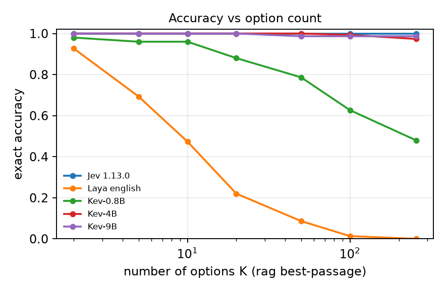
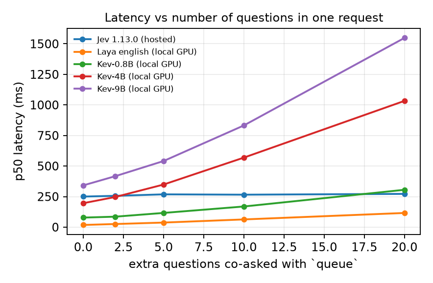

<p align="center">
  
</p>

<p align="center">
  <a href="https://pypi.org/project/sys1bench/"></a>
  <a href="https://pypi.org/project/sys1bench/"></a>
  <a href="https://github.com/rssr25/system-one-bench/actions/workflows/ci.yml"></a>
  <a href="LICENSE"></a>
</p>

<p align="center"><b>A benchmark for typed System One decision models</b><br>
Jev · Laya · Kev · and whatever comes next</p>

---

System One models read a block of state plus typed questions and return a probability distribution over the answers you defined — one of N options, a level on an ordinal scale, or yes/no — in a single forward pass. No text is generated, so nothing has to be parsed. **sys1bench** measures what that buys: whether the probabilities are calibrated (against a noise floor), how much the answer depends on how the question is worded, how confidence behaves out of scope, how accuracy scales with options and state length, whether batched questions interfere, and what it all costs per decision. Headline numbers come from generated items whose labels follow a stated policy, so they cannot be memorised.

```bash
pip install sys1bench
sys1bench suite all results/my-model --config my_model.yaml        # A–I on generated, policy-labelled data
sys1bench report results --html results/dashboard.html            # tables + interactive dashboard
```

## Results at a glance

<p align="center">
  
  
</p>
<p align="center">
  
  
</p>

<p align="center"><sub>Jev 1.13.0 (hosted), Laya 0.3.4 and Kev 0.8B / 4B / 9B (local, GB10) on identical generated manifests, n = 500, September 2026. Left to right: accuracy across five paraphrases and criteria variants of the same question (red = canonical wording); reliability on the same question; accuracy as the option count grows from 2 to 255; median latency as more questions share one request. Hosted latency includes the network path and is not comparable to local compute time.</sub></p>

## Why this benchmark

| | |
|---|---|
| **Policy-labelled data** | Labels follow a rule stated in the question (e.g. *urgency + 1 if angry + 1 if premium tier, cap 4*). A regex cannot solve it; neither can memorised public sets. Control arms are paired item-for-item: unknowable, label-noise, distractor, none-of-the-above. |
| **Calibration relative to noise** | Every ECE is divided by the ECE a perfectly calibrated model would show on that sample. Brier decomposition, clipped NLL, per-primitive temperature refit, quantisation report. |
| **Wording as a factor** | Accuracy is the median over five paraphrases and three criteria variants, with the range shown; adversarial wordings reported as a worst case. |
| **Selective prediction and cost** | Risk–coverage, coverage at 5 % risk, abstention with and without an explicit option, and realised cost per 10 k decisions under argmax, Bayes and escalate policies from per-question cost matrices. |
| **Ordinal, not categorical** | MAE, weighted kappa, ranked probability score, monotonicity along controlled severity ladders, 3/5/10-level scale invariance. |
| **Honest infrastructure** | Hosted and local latency never share an axis; the serving device is recorded on every row; a local model that lands on CPU when CUDA was requested aborts the run; every response is cached and re-derivable offline. |

## Add your model

A hosted model with a conventional JSON decisions API needs a config file, no code:

```bash
sys1bench configs example_future_vendor > my_model.yaml   # fill in url, auth env var, field names
```

Anything else subclasses `BaseAdapter` (declare capabilities, implement `decide`) and registers with `@register("my_model")` or the `sys1bench.adapters` entry-point group from your own package. Kev, which speaks the TypeSafe API, runs with `--config kev_4b` and no code at all.

## Documentation

- [Specification](docs/SPEC_v2.md) — contract, data tiers, suites A–I, statistics, audits, rules for future models
- [Design review](docs/REVIEW_v1.md) — how the design was derived from the public state of the art
- [Changelog](CHANGELOG.md) · [Issues](https://github.com/rssr25/system-one-bench/issues)

<p align="center"><sub>Apache 2.0 · Rahul Sharma · numbers change with model versions, so every row carries the version string the provider returned</sub></p>
